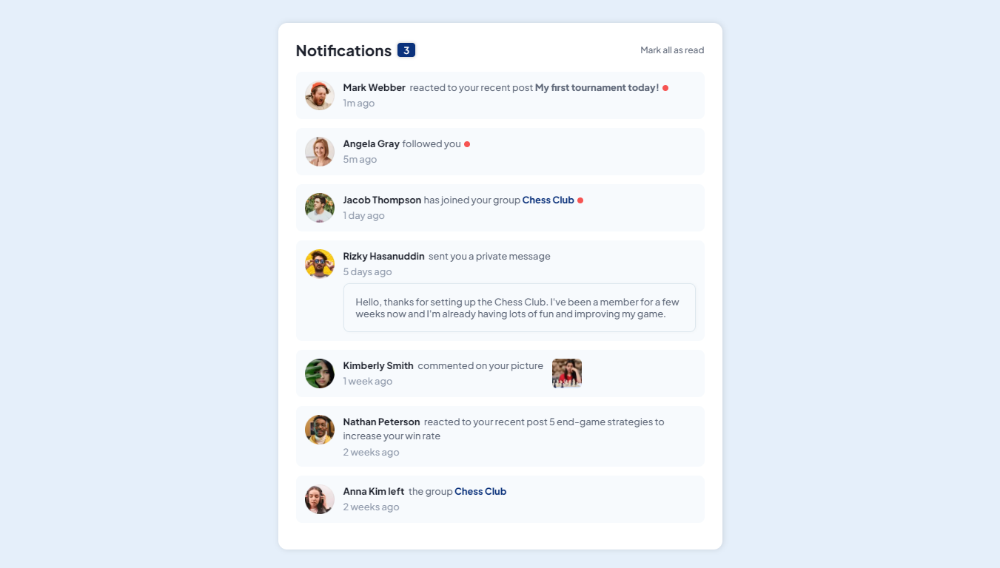
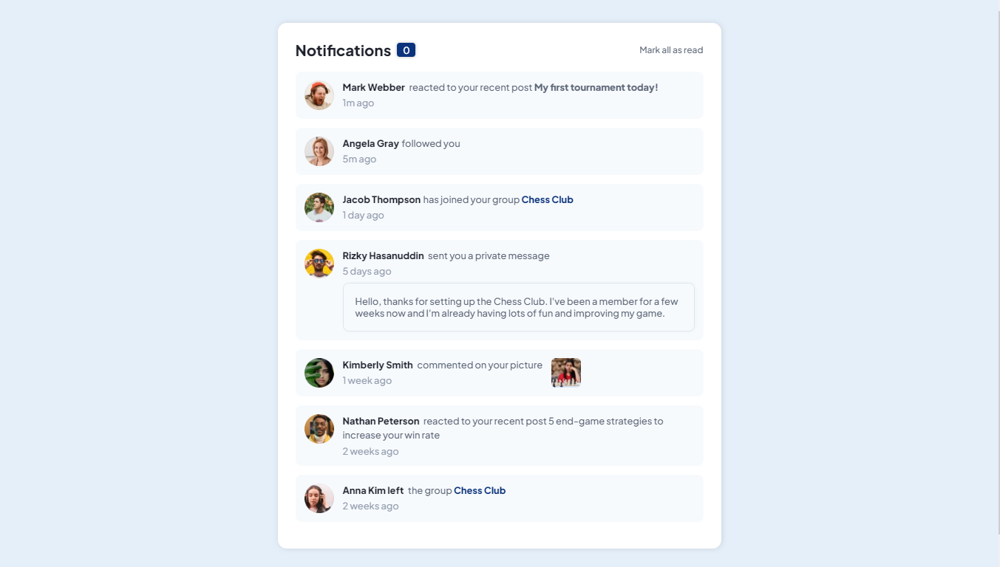
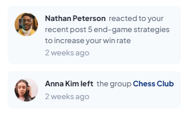
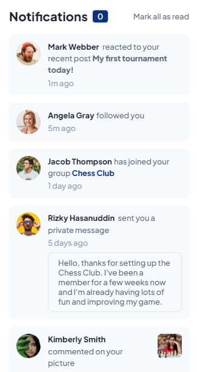

# Frontend Mentor - Notifications page solution

### Screenshot








### Links

- Solution URL: [https://github.com/Wellissonb/notifications-page]()
- Live Site URL: [https://wellissonb.github.io/notifications-page/]()

## My process

### Built with

- Semantic HTML5 markup
- CSS custom properties
- Flexbox
- Mobile-first workflow


**Note: These are just examples. Delete this note and replace the list above with your own choices**

### What I learned

Use this section to recap over some of your major learnings while working through this project. Writing these out and providing code samples of areas you want to highlight is a great way to reinforce your own knowledge.

To see how you can add code snippets, see below:

```html
<h1>Nothing newf</h1>
```
```css
.proud-of-this-css {
  color: Nothing new;
}
```
```js
const proudOfThisFunc = () => {
  console.log('I learned how to access and change the styles of a pseudo element with javascript')
}
```

